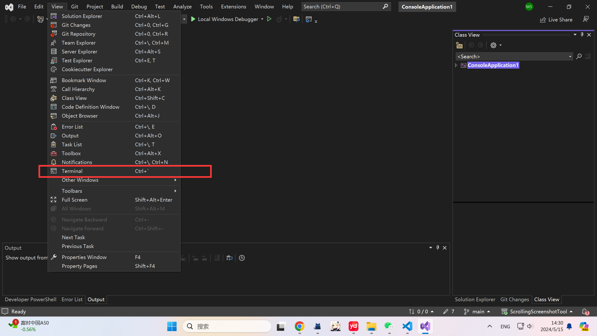
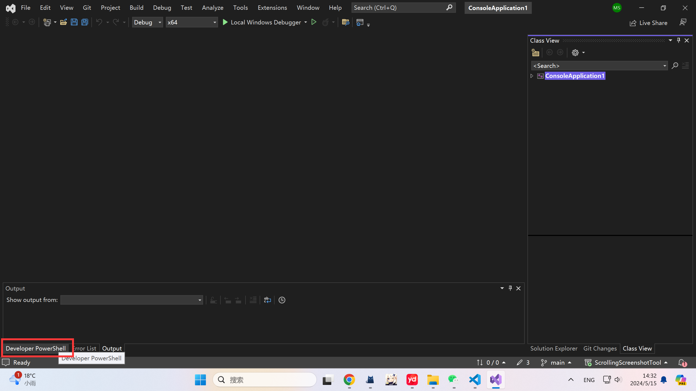
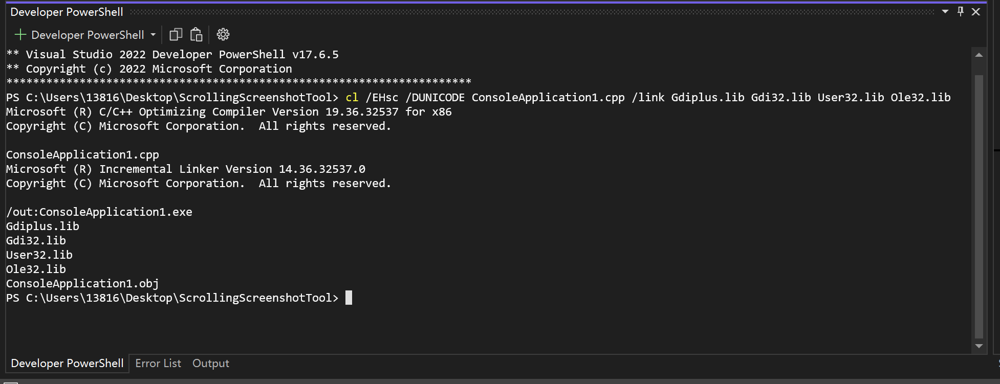

## ScrollingScreenshotTool
c++ homework

## git 代理设置
```bash
git config --global http.proxy http://127.0.0.1:7890
git config --global https.proxy https://127.0.0.1:7890
```
取消代理
```bash
git config --global --unset http.proxy
git config --global --unset https.proxy
```

## 如何编译？







```bash
cl /EHsc /DUNICODE ScrollingScreenshotTool.cpp /link Gdiplus.lib Gdi32.lib User32.lib Ole32.lib
```


```bash
cl /EHsc demo\main1.cpp user32.lib
```